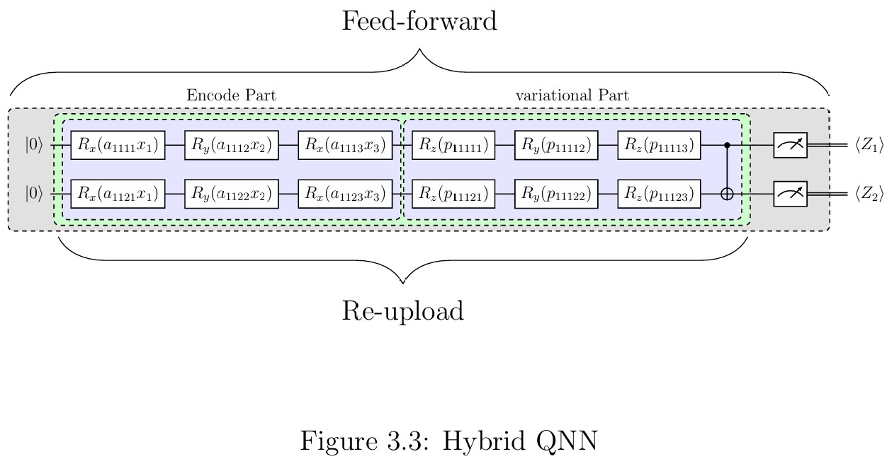

# Hybrid QNN Circuit: Measurement Feed-Forward and Data Re-Upload Structures

This repository contains the implementation code for the thesis "Quantum Classifiers Using Measurement Feed-forward Quantum Neural Network" [doi:10.6342/NTU202404165](https://drive.google.com/file/d/1yV0NOxuzr9Q0HYPzrn0tAS_NhO4z8QIa/view?usp=drive_link). For detailed information about the methodology and results, please refer to the thesis document. 

## Purpose
The main results presented in the thesis were originally obtained using the Jupyter Notebook script located in ```Old_files/Original_script.ipynb```. This repository builds on that work, reorganizing and rewriting the original code into a modular and user-friendly framework. The goal is to provide a tool for researchers and developers to easily utilize the hybrid quantum neural network (QNN) framework, which combines feed-forward and re-upload structures.


## Overview
This repository explores the integration of feed-forward and re-upload structures in hybrid quantum neural networks (QNNs).
The motivation for combining these structures stems from their distinct roles in enhancing QNN performance:

* Measurement feed-forward Structure[[1]](#1): This structure is analogous to multi-hidden layers in classical neural networks (NNs). The measurement results (outputs) of one layer are used as inputs for the subsequent layer, creating a feed-forward mechanism. This structure introduces non-linearity through measurement operations and enables the construction of complex models using multiple short circuits, which reduces gate error accumulation compared to deep, single-layer circuits.
* Data re-upload Structure: This structure is analogous to multiple neurons within a single layer[[2]](#2)., this structure emphasizes the repeated encoding of inputs to improve learning capacity.


### Advantages of the Feed-Forward Circuit
The feed-forward approach provides the following key benefits:

* Non-Linearity: Measurement operations introduce non-linear transformations to the model.
* Error Reduction: Shorter circuits reduce gate error accumulation compared to longer, deeper circuits.
* Scalability: The combination of feed-forward and re-upload structures allows for flexible and scalable quantum circuit designs.


## Installation 
This repository is not yet packaged as an official Python package. To use the framework, you can download the reupload_ff_circuit folder and directly import the modules into your project. Refer to the Demo_script.ipynb file for usage examples.

### Requirements
This repository is developed under Python 3.13.0 and depends on the following key libraries: 

* PennyLane: [0.40.0.dev23](https://github.com/PennyLaneAI/pennylane.git)
* PennyLane-qiskit: 0.39.0
* JAX: 0.4.35

To ensure compatibility and avoid dependency conflicts, it is recommended to use Anaconda to create a virtual environment: 

```conda env create --file test_env.yaml```

## Getting Started

This section introduces how to use the hybrid QNN circuit functions provided in this repository. The schematic structure of the hybrid QNN is shown below:

<!--  -->
<p align="center">

### Overview of Hybrid QNN Structure
The hybrid QNN structure is defined by five key parameters:
* Encoding number ($n_{enc}$): Number of rotation gates used to encode data into the circuit.
* Qubit number ($n_q$): Number of qubits assigned to the hybrid QNN circuit.
* Feed-forward number ($n_f$): Number of feed-forward layers. A value of 1 means no feed-forward structure is applied.
* Re-upload number ($n_r$): Number of repetitions of the encoding and variational parts.
* Variational number ($n_v$): Number of repetitions of general rotation gates and a CNOT gate in the variational part.

These parameters are required as positional arguments for the ```qcircuit``` class, which is defined in reupload_ff_circuit/q_circuits.py.

Parameter Details:

1. Encoding number ($n_{enc}$):
Specifies the number of rotation gates for encoding input data. The sequence follows $R_x(x_1)R_y(x_2)R_x(x_3)...$. 
    * Ensure $n_{enc}*n_q \ge $ the number of features in the input data.
    * For detailed encoding rules, refer to the thesis (p. 25).

2. Qubit number ($n_q$):
Determines the number of qubits allocated for the hybrid QNN circuit.

3. Feed-forward number ($n_f$):
Sets the number of feed-forward layers. A value of 1 disables the feed-forward structure.

4. Re-upload number ($n_r$):
Specifies how many times the encoding and variational parts are repeated.

5. Variational number ($n_v$):
Indicates the number of repetitions of general rotation gates and a CNOT gate in the variational part.

### Example: Calculate Measurement Output

To calculate the measurement output of the input data for a given circuit structure, follow these three steps:

Step 1: Assign the Circuit Structure
```
from reupload_ff_circuit.q_functions import *
from reupload_ff_circuit.q_circuits import *

setting = n_enc, n_q ,n_f, n_r, n_v = 5, 2 , 2, 3, 2 # 
qc = qcircuit(*setting)
``` 
Step 2: Define Predefined States and Initialize Parameters
```
state_labels, dm_labels, _ = predefined_states_dm(shape:='tetrahedron',n_q) 
params = initialize_params(*setting, len(state_labels), seed_num=42)
```
Step 3: Input Data and Calculate Results

```
x_data = jnp.array([[1,2,3],[4,5,6]])
results = qc.qc_nq(params, x_data.T, dm_labels[0])
```
or 
```
results = qc.jqc_nq(params, x_data.T, dm_labels[0])
```
### Notes:
1. Input Data Shape
    *  x_data must be an array-like object with the shape (# of data points, # of features). 
    * Ensure the feature count aligns with the encoding rules discussed above.
2. Function Variants
    * qc_nq(): The standard function to calculate results.
    * jqc_nq(): An optimized version accelerated by jax.jit compilation for faster execution.
### ⚠️ Memory Considerations

* The jqc_nq() function is memory-intensive, particularly for large datasets or circuits.
* While memory usage optimization is planned, this is currently a side project. Updates will be made only as time permits, or if sponsorship is provided to accelerate the process. Contributions are welcome!

## License
This repository is shared for research and educational purposes. If you use this code in your research, please cite the thesis linked above.

## Final Remarks:
If you encounter any issues or have suggestions for improvements, feel free to open an issue or submit a pull request. However, please note that updates to this repository may be infrequent unless I have additional time or external support to prioritize its development.


## Reference

<a id="1">[1]</a>
: Hao-Wei Lai. Deep neural network with quantum circuits and hybrid neurons, 2020.

<a id="2">[2]</a>: P{\'e}rez-Salinas, Adri{\'a}n and Cervera-Lierta, Alba and Gil-Fuster, Elies and Latorre, Jos{\'e} I. Data re-uploading for a universal quantum classifier. Quantum, 4:226, 2020.

